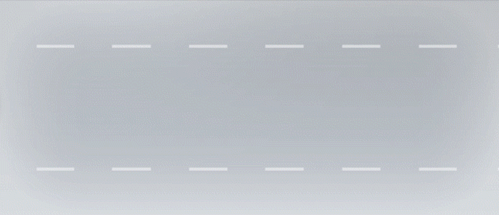

# Welcome

This is a simulation based testing on cut-out-scenerio tested in straight and curved roads

# Cut-Out Scenario

The cut-out scenario involves three vehicles including our EGO vehicle. In this scenario, a vehicle in front of EGO vehicle leaves the lane abruptly to avoid a stopped or lower-speed vehicle ahead, leaving the system on EGO only a short time to identify and respond to the situation.

## 1. Scenarios

You will consider the following scenarios in this project

- Cut-off scenario (straight road)
- Cut-off scenario (curved road)

and randomly pick 25 samples for each scenario using the following parameter model:
|